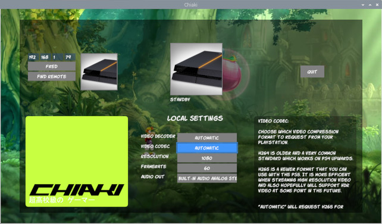

**This Chiaki Fork is specialized to run on Raspberrry Pi hardware.   
For installation instructions please go here,**

https://github.com/Fredrum/chiaki/wiki/rpi02---branch-for-Bullseye,-64bit,-h265-and-kmsdrm

